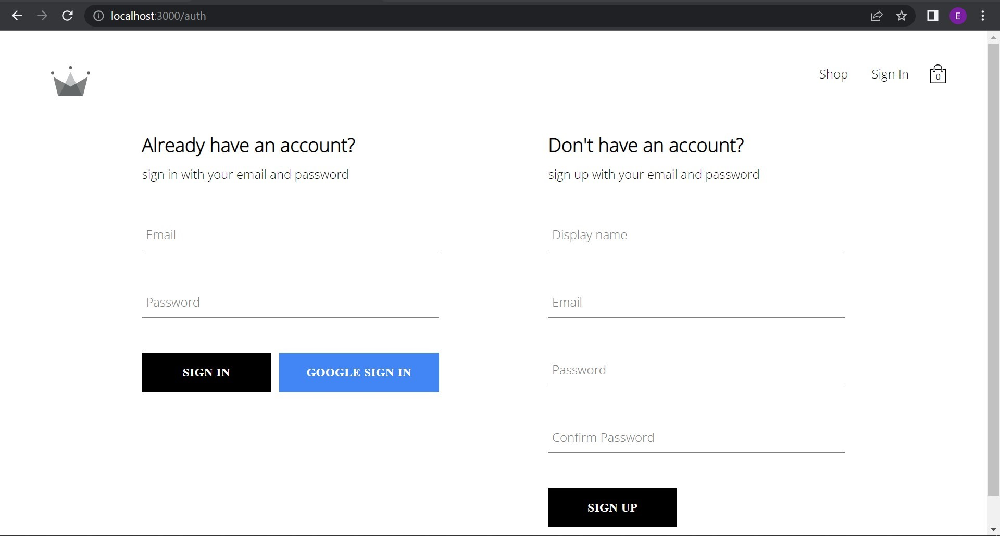

# crown-clothing

### crown-clothing is an online clothing market app. 

## Screenshots 📷

 

 

## Technologies ⚛️
 - `React JS`
 - `Firebase`
 - `react-compnents`
 - `scss`
 - `redux`

## Setup / Installation 💻
- download or clone the repository
- run `npm install`
- `npm start`

## status
### 🚧under construction🚧

## Credits 📝
List of contriubutors:

- Eyader Tsehayu(eyaderts@gmail.com)
- zero to mastery full react course
- Andrei Neagoie
- yihua Zhang

